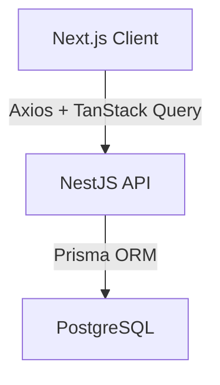

# System Patterns

## Architecture Overview



## Design Patterns

### Frontend Patterns

1. Component Architecture

   - Smart/Container components for logic
   - Presentational components for UI
   - Reusable UI components with shadcn/ui
   - Context for global state management
   - Strict type definitions for components

2. State Management

   - React Hooks for local state
   - Context for global state (auth, theme)
   - TanStack Query for server state
   - Form state using react-hook-form
   - Validation with yup schemas

3. Code Organization
   ```
   web/
   ├── src/
   │   ├── app/
   │   │   ├── (public)/     # Public-facing pages
   │   │   ├── (private)/    # Authenticated user pages
   │   │   └── api/          # API route handlers
   │   ├── components/
   │   │   ├── ui/           # Reusable UI components
   │   │   ├── layout/       # Layout components
   │   │   ├── transaction/  # Transaction components
   │   │   ├── auth/         # Authentication components
   │   │   ├── dashboard/    # Dashboard components
   │   │   ├── event/        # Event tracking components
   │   │   └── reports/      # Reporting components
   │   ├── hooks/            # Custom hooks
   │   ├── lib/              # Utility functions
   │   ├── providers/        # Context providers
   │   ├── services/         # API services
   │   ├── types/            # TypeScript type definitions
   │   └── constants/        # Application constants
   ```

### Form Patterns

1. Form Management

   - react-hook-form for form state
   - yup for validation schemas
   - Controlled components for complex inputs
   - Field-level validation with error messages
   - Form submission with loading states

2. Dialog Management

   - Shared dialog components for similar operations
   - Differentiation based on operation type (create/edit)
   - Clear submission and cancel flows
   - Proper error handling and validation feedback
   - Form state reset on dialog close

3. Component Interaction
   - Controlled event propagation
   - Proper focus management for accessibility
   - Mobile-friendly interactions
   - Consistent form submission patterns
   - Loading state indicators

### Backend Patterns

1. Module Architecture

   - Feature-based modules (auth, transaction, event, reports)
   - Service layer for business logic
   - Controller layer for API endpoints
   - DTOs for type-safe request/response
   - Prisma for data access

2. Code Organization
   ```
   api/
   ├── src/
   │   ├── modules/
   │   │   ├── auth/         # Authentication module
   │   │   ├── transaction/  # Transaction management
   │   │   ├── reports/      # Reporting functionality
   │   │   ├── event/        # Event tracking
   │   │   └── settings/     # User settings
   │   ├── config/           # Application configuration
   │   ├── constants/        # Shared constants
   │   └── shared/           # Shared utilities and types
   ├── prisma/
   │   ├── schema.prisma     # Data model definition
   │   └── migrations/       # Database migrations
   ```

## Data Model

1. Core Entities

   - User: Application user with authentication
   - Transaction: Financial transaction (income/expense)
   - Category: Transaction categorization
   - Event: Financial occasion tracking
   - Settings: User preferences

2. Entity Relationships
   ```mermaid
   erDiagram
       USER ||--o{ TRANSACTION : has
       USER ||--o{ CATEGORY : has
       USER ||--o{ EVENT : has
       USER ||--|| SETTINGS : has
       CATEGORY ||--o{ TRANSACTION : categorizes
       EVENT ||--o{ TRANSACTION : groups
   ```

## Component Relationships

1. UI Components

   - Based on shadcn/ui component library
   - Tailwind CSS for styling
   - Support for theme switching (light/dark)
   - Responsive design for all device sizes
   - Consistent component API patterns

2. Data Flow

   - One-way data flow pattern
   - Props for component communication
   - Context for global state (auth, theme)
   - Custom hooks for reusable logic
   - TanStack Query for server state management

3. Authentication Flow
   - JWT-based authentication with refresh tokens
   - Token refresh on 401 responses
   - Access token (short-lived) for API authorization
   - Refresh token (long-lived) for getting new access tokens
   - Token rotation for enhanced security

## Error Handling

1. Frontend

   - Try/catch for async operations
   - Error boundaries for component errors
   - Toast notifications for user feedback
   - Form validation with meaningful error messages
   - API error handling with user-friendly messages

2. Backend
   - Exception filters for consistent error responses
   - Custom exception types for specific errors
   - Validation pipes for DTO validation
   - Logging for error tracking
   - API responses with appropriate status codes and messages

## Performance Patterns

1. Frontend

   - Lazy loading of components
   - Memoization for expensive computations
   - Optimized re-renders with React.memo and useMemo
   - Pagination for large datasets
   - Virtualization for long lists

2. Backend
   - Database query optimization
   - Caching frequently accessed data
   - Efficient filtering with database indexes
   - Pagination of large result sets
   - Optimized transaction operations
