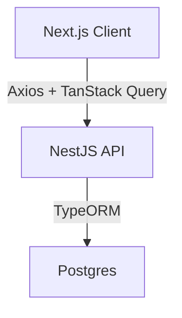

# System Patterns

## Architecture Overview



## Design Patterns

### Frontend Patterns

1. Component Architecture

   - Smart/Container components for logic
   - Presentational components for UI
   - Reusable UI components with props
   - Consolidated dialogs for similar operations

2. State Management

   - React Hooks for local state
   - Context for global state
   - TanStack Query for server state
   - Form state using react-hook-form

3. Code Organization
   ```
   web/
   ├── app/
   │   ├── (public)/     # Public-facing pages
   │   ├── (private)/    # Authenticated user pages
   │   └── api/          # API route handlers
   ├── components/
   │   ├── ui/           # Reusable UI components
   │   ├── layout/       # Layout components
   │   └── transaction/  # Feature-specific components
   ├── hooks/            # Custom hooks
   ├── lib/              # Utility functions
   ├── types/            # TypeScript type definitions
   └── constants/        # Application constants
   ```

### Form Patterns

1. Form Management

   - react-hook-form for form state
   - yup for validation schemas
   - Custom form components for reusability
   - Consistent error handling

2. Dialog Management

   - Shared dialog for create/edit operations
   - Differentiation based on ID presence
   - Centralized dialog state management
   - Proper cleanup on dialog close

3. Component Interaction
   - z-index management for nested components
   - Event propagation control
   - Popover positioning and behavior
   - Consistent form submission patterns

### Backend Patterns

1. Module Architecture

   - Feature-based modules
   - Service layer for business logic
   - Repository pattern for data access

2. Code Organization
   ```
   api/
   ├── src/
   │   ├── modules/     # Feature modules
   │   ├── common/      # Shared code
   │   ├── config/      # Configuration
   │   └── utils/       # Utility functions
   ```

## Component Relationships

1. UI Components

   - Follow shadcn patterns
   - Use Tailwind for styling
   - Support theme customization
   - Consistent padding and spacing

2. Data Flow

   - One-way data flow
   - Props for component communication
   - Context for global state
   - Custom hooks for logic reuse
   - TanStack Query for server state

3. Dialog and Popover Pattern
   - Single dialog with conditional content
   - Dynamic titles based on operation type
   - ID-based differentiation for edit/create
   - State reset on dialog close

## Error Handling

1. Frontend

   - Try/catch for async operations
   - Error boundaries for component errors
   - Toast notifications for user feedback
   - Form validation with yup schemas

2. Backend
   - Global exception filter
   - Custom error types
   - Consistent error responses

## Performance Patterns

1. Frontend

   - Lazy loading of components
   - Memoization of expensive calculations
   - Optimized re-renders
   - Controlled API refetching

2. Backend
   - Request caching
   - Database query optimization
   - Response compression
