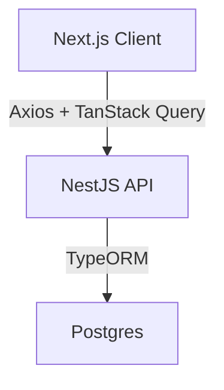

# System Patterns

## Architecture Overview



## Design Patterns

### Frontend Patterns

1. Component Architecture

   - Smart/Container components for logic
   - Presentational components for UI
   - Reusable UI components with props

2. State Management

   - React Hooks for local state
   - Context for global state
   - TanStack Query for server state

3. Code Organization
   ```
   web/
   ├── components/
   │   ├── ui/          # Reusable UI components
   │   └── features/    # Feature-specific components
   ├── hooks/           # Custom hooks
   ├── pages/           # Next.js pages
   ├── styles/          # Global styles
   └── utils/           # Utility functions
   ```

### Backend Patterns

1. Module Architecture

   - Feature-based modules
   - Service layer for business logic
   - Repository pattern for data access

2. Code Organization
   ```
   api/
   ├── src/
   │   ├── modules/     # Feature modules
   │   ├── common/      # Shared code
   │   ├── config/      # Configuration
   │   └── utils/       # Utility functions
   ```

## Component Relationships

1. UI Components

   - Follow shadcn patterns
   - Use Tailwind for styling
   - Support theme customization

2. Data Flow
   - One-way data flow
   - Props for component communication
   - Context for global state
   - Custom hooks for logic reuse

## Error Handling

1. Frontend

   - Try/catch for async operations
   - Error boundaries for component errors
   - Toast notifications for user feedback

2. Backend
   - Global exception filter
   - Custom error types
   - Consistent error responses

## Performance Patterns

1. Frontend

   - Lazy loading of components
   - Memoization of expensive calculations
   - Optimized re-renders

2. Backend
   - Request caching
   - Database query optimization
   - Response compression
